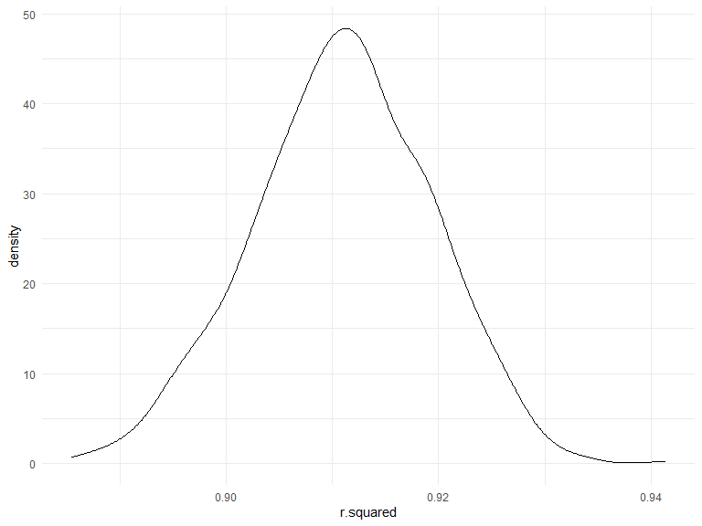
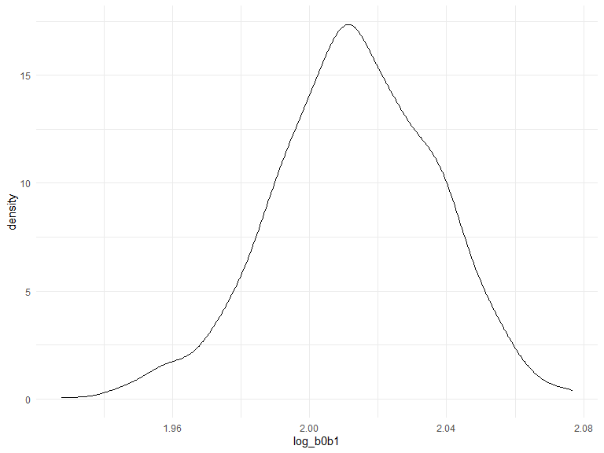
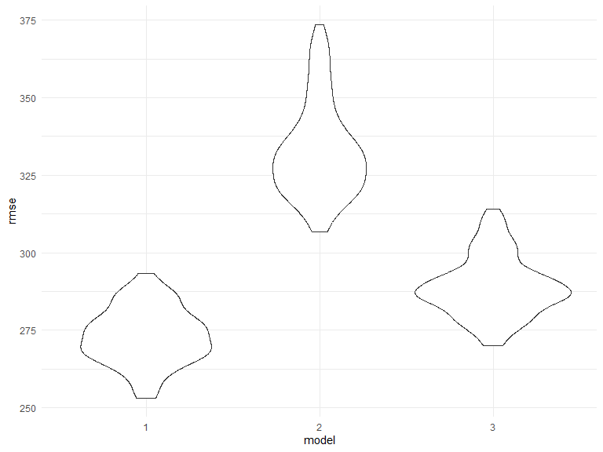

P8105_hw6
================
qz2492
2022-12-03

## Problem 1

To obtain a distribution for $\hat{r}^2$, we’ll follow basically the
same procedure we used for regression coefficients: draw bootstrap
samples; the a model to each; extract the value I’m concerned with; and
summarize. Here, we’ll use `modelr::bootstrap` to draw the samples and
`broom::glance` to produce `r.squared` values.

``` r
weather_df = 
  rnoaa::meteo_pull_monitors(
    c("USW00094728"),
    var = c("PRCP", "TMIN", "TMAX"), 
    date_min = "2017-01-01",
    date_max = "2017-12-31") %>%
  mutate(
    name = recode(id, USW00094728 = "CentralPark_NY"),
    tmin = tmin / 10,
    tmax = tmax / 10) %>%
  select(name, id, everything())
```

    ## Registered S3 method overwritten by 'hoardr':
    ##   method           from
    ##   print.cache_info httr

    ## using cached file: C:\Users\QILINZ~1\AppData\Local/Cache/R/noaa_ghcnd/USW00094728.dly

    ## date created (size, mb): 2022-12-03 17:08:20 (8.445)

    ## file min/max dates: 1869-01-01 / 2022-12-31

``` r
weather_df %>% 
  modelr::bootstrap(n = 1000) %>% 
  mutate(
    models = map(strap, ~lm(tmax ~ tmin, data = .x) ),
    results = map(models, broom::glance)) %>% 
  select(-strap, -models) %>% 
  unnest(results) %>% 
  ggplot(aes(x = r.squared)) + geom_density()
```



In this example, the $\hat{r}^2$ value is high, and the upper bound at 1
may be a cause for the generally skewed shape of the distribution. If we
wanted to construct a confidence interval for $R^2$, we could take the
2.5% and 97.5% quantiles of the estimates across bootstrap samples.
However, because the shape isn’t symmetric, using the mean +/- 1.96
times the standard error probably wouldn’t work well.

We can produce a distribution for $\log(\beta_0 * \beta1)$ using a
similar approach, with a bit more wrangling before we make our plot.

``` r
weather_df %>% 
  modelr::bootstrap(n = 1000) %>% 
  mutate(
    models = map(strap, ~lm(tmax ~ tmin, data = .x) ),
    results = map(models, broom::tidy)) %>% 
  select(-strap, -models) %>% 
  unnest(results) %>% 
  select(id = `.id`, term, estimate) %>% 
  pivot_wider(
    names_from = term, 
    values_from = estimate) %>% 
  rename(beta0 = `(Intercept)`, beta1 = tmin) %>% 
  mutate(log_b0b1 = log(beta0 * beta1)) %>% 
  ggplot(aes(x = log_b0b1)) + geom_density()
```



As with $r^2$, this distribution is somewhat skewed and has some
outliers.

The point of this is not to say you should always use the bootstrap –
it’s possible to establish “large sample” distributions for strange
parameters / values / summaries in a lot of cases, and those are great
to have. But it is helpful to know that there’s a way to do inference
even in tough cases.

## Problem 2

``` r
homicide = read_csv('./data/homicide-data.csv') %>%
  janitor::clean_names()
```

    ## Rows: 52179 Columns: 12
    ## ── Column specification ────────────────────────────────────────────────────────
    ## Delimiter: ","
    ## chr (9): uid, victim_last, victim_first, victim_race, victim_age, victim_sex...
    ## dbl (3): reported_date, lat, lon
    ## 
    ## ℹ Use `spec()` to retrieve the full column specification for this data.
    ## ℹ Specify the column types or set `show_col_types = FALSE` to quiet this message.

#### Create a city_state variable (e.g. “Baltimore, MD”), and a binary variable indicating whether the homicide is solved. . For this problem, limit your analysis those for whom victim_race is white or black. Be sure that victim_age is numeric.

``` r
prob2_df = 
  homicide %>% 
  mutate(
    city_state = str_c(city, state, sep = "_"),
    victim_age = as.numeric(victim_age),
    solved = as.numeric(disposition == "Closed by arrest")) %>% 
  filter(
    victim_race %in% c("White", "Black") &
    !(city_state %in% c("Dallas_TX", "Phoenix_AZ", " Kansas City_MO", "Tulsa_AL"))) %>% 
  select(city_state, solved, victim_age, victim_race, victim_sex)
```

#### For the city of Baltimore, MD, use the glm function to fit a logistic regression with resolved vs unresolved as the outcome and victim age, sex and race as predictors. Save the output of glm as an R object; apply the broom::tidy to this object; and obtain the estimate and confidence interval of the adjusted odds ratio for solving homicides comparing male victims to female victims keeping all other variables fixed.

``` r
baltimore_df = prob2_df %>%
  filter(city_state == "Baltimore_MD")

baltimore_fit = glm(solved ~ victim_age + victim_sex + victim_race, family = binomial, data = baltimore_df) 
  
baltimore_fit %>%
  broom::tidy() %>%
  mutate(
    OR = exp(estimate),
    Conf_low = exp(estimate - 1.96 * std.error),
    Conf_high = exp(estimate + 1.96 * std.error)
  ) %>%
  filter(term == "victim_sexMale") %>%
  select(term, OR, Conf_low, Conf_high) %>%
  knitr::kable(digits = 4)
```

| term           |     OR | Conf_low | Conf_high |
|:---------------|-------:|---------:|----------:|
| victim_sexMale | 0.4255 |   0.3246 |    0.5579 |

#### Now run glm for each of the cities in your dataset, and extract the adjusted odds ratio (and CI) for solving homicides comparing male victims to female victims. Do this within a “tidy” pipeline, making use of purrr::map, list columns, and unnest as necessary to create a dataframe with estimated ORs and CIs for each city.

``` r
all_fit = 
  prob2_df %>%
  nest(data = -city_state) %>%
  mutate(
    model = map(.x = data, ~glm(solved ~ victim_age + victim_sex + victim_race, family = binomial, data = .x)),
    result = map(model, broom::tidy)
  ) %>%
  unnest(result) %>%
  mutate(
    OR = exp(estimate),
    Conf_low = exp(estimate - 1.96 * std.error),
    Conf_high = exp(estimate + 1.96 * std.error)
  ) %>%
  filter(term == "victim_sexMale") %>%
  select(city_state, OR, Conf_low, Conf_high) 

all_fit %>%
  knitr::kable(digits = 4)
```

| city_state        |     OR | Conf_low | Conf_high |
|:------------------|-------:|---------:|----------:|
| Albuquerque_NM    | 1.7675 |   0.8307 |    3.7609 |
| Atlanta_GA        | 1.0001 |   0.6836 |    1.4631 |
| Baltimore_MD      | 0.4255 |   0.3246 |    0.5579 |
| Baton Rouge_LA    | 0.3814 |   0.2093 |    0.6953 |
| Birmingham_AL     | 0.8700 |   0.5743 |    1.3180 |
| Boston_MA         | 0.6740 |   0.3560 |    1.2760 |
| Buffalo_NY        | 0.5206 |   0.2898 |    0.9352 |
| Charlotte_NC      | 0.8839 |   0.5570 |    1.4027 |
| Chicago_IL        | 0.4101 |   0.3360 |    0.5006 |
| Cincinnati_OH     | 0.3998 |   0.2361 |    0.6771 |
| Columbus_OH       | 0.5325 |   0.3783 |    0.7496 |
| Denver_CO         | 0.4791 |   0.2364 |    0.9707 |
| Detroit_MI        | 0.5823 |   0.4622 |    0.7337 |
| Durham_NC         | 0.8124 |   0.3920 |    1.6833 |
| Fort Worth_TX     | 0.6690 |   0.3969 |    1.1275 |
| Fresno_CA         | 1.3352 |   0.5805 |    3.0709 |
| Houston_TX        | 0.7110 |   0.5577 |    0.9066 |
| Indianapolis_IN   | 0.9187 |   0.6794 |    1.2423 |
| Jacksonville_FL   | 0.7198 |   0.5365 |    0.9657 |
| Las Vegas_NV      | 0.8373 |   0.6077 |    1.1537 |
| Long Beach_CA     | 0.4102 |   0.1555 |    1.0821 |
| Los Angeles_CA    | 0.6619 |   0.4581 |    0.9563 |
| Louisville_KY     | 0.4906 |   0.3047 |    0.7897 |
| Memphis_TN        | 0.7232 |   0.5292 |    0.9884 |
| Miami_FL          | 0.5152 |   0.3045 |    0.8719 |
| Milwaukee_wI      | 0.7271 |   0.4987 |    1.0602 |
| Minneapolis_MN    | 0.9470 |   0.4783 |    1.8749 |
| Nashville_TN      | 1.0342 |   0.6847 |    1.5622 |
| New Orleans_LA    | 0.5849 |   0.4218 |    0.8112 |
| New York_NY       | 0.2624 |   0.1379 |    0.4991 |
| Oakland_CA        | 0.5631 |   0.3651 |    0.8684 |
| Oklahoma City_OK  | 0.9741 |   0.6241 |    1.5203 |
| Omaha_NE          | 0.3825 |   0.2030 |    0.7208 |
| Philadelphia_PA   | 0.4963 |   0.3776 |    0.6522 |
| Pittsburgh_PA     | 0.4308 |   0.2651 |    0.6999 |
| Richmond_VA       | 1.0061 |   0.4980 |    2.0326 |
| San Antonio_TX    | 0.7046 |   0.3977 |    1.2485 |
| Sacramento_CA     | 0.6688 |   0.3347 |    1.3365 |
| Savannah_GA       | 0.8670 |   0.4223 |    1.7801 |
| San Bernardino_CA | 0.5003 |   0.1712 |    1.4622 |
| San Diego_CA      | 0.4130 |   0.1995 |    0.8550 |
| San Francisco_CA  | 0.6075 |   0.3168 |    1.1651 |
| St. Louis_MO      | 0.7032 |   0.5304 |    0.9323 |
| Stockton_CA       | 1.3517 |   0.6211 |    2.9416 |
| Tampa_FL          | 0.8077 |   0.3478 |    1.8760 |
| Tulsa_OK          | 0.9758 |   0.6136 |    1.5517 |
| Washington_DC     | 0.6902 |   0.4684 |    1.0170 |

#### Create a plot that shows the estimated ORs and CIs for each city. Organize cities according to estimated OR, and comment on the plot.

``` r
all_fit %>%
  mutate(
    city_state = fct_reorder(city_state, OR)) %>%
  ggplot(aes(x = OR, y = city_state)) +
  geom_point() +
  geom_errorbar(aes(xmin = Conf_low, xmax = Conf_high)) +
  labs(title = "The estimated ORs and CIs of solved cases for each city")
```


From the plot we can tell that not considering race and age, most cities
in America have odds ratios lower than 1, which indicates male victims
have lower odds than female victims to have their cases solved. Among
those New York city has the smallest odds ratios, indicating male
victims in NYC have the smallest chance to have their cases solved.

## Problem 3

#### Load and clean the data for regression analysis (i.e. convert numeric to factor where appropriate, check for missing data, etc.).

``` r
birthweight = read_csv('./data/birthweight.csv') %>%
  janitor::clean_names() %>%
  mutate(
    babysex = as.factor(babysex),
    frace = as.factor(frace),
    malform = as.factor(malform),
    mrace = as.factor(mrace)
  ) %>%
  select(-pnumsga, -pnumlbw) %>%
  drop_na() %>%
  relocate(bwt)
```

    ## Rows: 4342 Columns: 20
    ## ── Column specification ────────────────────────────────────────────────────────
    ## Delimiter: ","
    ## dbl (20): babysex, bhead, blength, bwt, delwt, fincome, frace, gaweeks, malf...
    ## 
    ## ℹ Use `spec()` to retrieve the full column specification for this data.
    ## ℹ Specify the column types or set `show_col_types = FALSE` to quiet this message.

Except for `fincome`, all other variables are intuitive factors
influencing a baby’s birthweight owing to biological connections.

Let’s take a look at the exploratory plots:

``` r
numeric_variables = 
  birthweight %>%
  select(-babysex, -frace, -malform, -mrace)
GGally::ggpairs(numeric_variables)
```

    ## Registered S3 method overwritten by 'GGally':
    ##   method from   
    ##   +.gg   ggplot2


``` r
corrplot::corrplot(cor(numeric_variables), type = "upper", diag = FALSE)
```


``` r
factor_variables = 
  birthweight %>%
  select(bwt, babysex, frace, malform, mrace) %>%
  mutate(
    babysex = as.numeric(babysex),
    frace = as.numeric(frace),
    malform = as.numeric(malform),
    mrace = as.numeric(mrace)
  )

corrplot::corrplot(cor(factor_variables), type = "upper", diag = FALSE)
```


We can tell from the plots that `bhead`, `blength`, `delwt`, `gaweeks`,
`wtgain`, `frace` and `mrace` may have the biggest influence on
birthweight.

Now fit the model using stepwise regression:

``` r
intercept_only = lm(bwt ~ 1, data = birthweight)

biggest_model = lm(bwt ~ ., data = birthweight)

model_1 = step(intercept_only, direction='both', scope=formula(biggest_model), trace = 0)

equatiomatic::extract_eq(model_1, use_coefs = TRUE)
```

$$
\operatorname{\widehat{bwt}} = -5683.32 + 130.84(\operatorname{bhead}) + 74.98(\operatorname{blength}) - 138.83(\operatorname{mrace}_{\operatorname{2}}) - 76.35(\operatorname{mrace}_{\operatorname{3}}) - 101.78(\operatorname{mrace}_{\operatorname{4}}) + 4.11(\operatorname{delwt}) + 11.58(\operatorname{gaweeks}) - 4.84(\operatorname{smoken}) - 9.22(\operatorname{ppbmi}) + 28.56(\operatorname{babysex}_{\operatorname{2}}) + 95.9(\operatorname{parity}) - 1.07(\operatorname{ppwt}) + 0.32(\operatorname{fincome})
$$ This model includes `bhead`, `blength`, `mrace`, `delwt`, `gaweeks`,
`smoken`, `ppbmi`, `babysex`, `parity`, `ppwt` and `fincome`, more
variables than I think have an influence on birthweight.

#### show a plot of model residuals against fitted values

``` r
birthweight %>%
  add_predictions(model_1) %>%
  add_residuals(model_1) %>%
  ggplot(aes(x = pred, y = resid)) +
  geom_point() +
  labs(title = "model residuals against fitted values")
```


``` r
# fit two other models
model_2 = lm(bwt ~ gaweeks + blength, data = birthweight)
model_3 = lm(bwt ~ bhead + blength + babysex + bhead * blength + bhead * babysex + blength * babysex + bhead * blength * babysex, data = birthweight)
```

#### Compare my model to two others:

``` r
cv = 
  crossv_mc(birthweight, 100) %>% 
  mutate(
    train = map(train, as_tibble),
    test = map(test, as_tibble)
  ) %>% 
  mutate(
   model_1 = map(.x = train, ~lm(formula(model_1), data = .x)),
   model_2 = map(.x = train, ~lm(formula(model_2), data = .x)),
   model_3 = map(.x = train, ~lm(formula(model_3), data = .x))
  ) %>% 
  mutate(
    rmse_1 = map2_dbl(.x = model_1, .y = test, ~rmse(model = .x, data = .y)),
    rmse_2 = map2_dbl(.x = model_2, .y = test, ~rmse(model = .x, data = .y)),
    rmse_3 = map2_dbl(.x = model_3, .y = test, ~rmse(model = .x, data = .y))
  )
```

Using violin plots to show comparison among three models

``` r
cv %>% 
  select(starts_with("rmse")) %>% 
  pivot_longer(
    everything(),
    names_to = "model", 
    values_to = "rmse",
    names_prefix = "rmse_") %>% 
  mutate(model = fct_inorder(model)) %>% 
  ggplot(aes(x = model, y = rmse)) + 
  geom_violin()
```



From the plot we can tell that our model has the lowest rmse, which
indicates its prediction is most reliable among them all, and the model
only contains `gaweeks` and `blength` has the worst result, it looks
like the more variable we include in our model, the better it would be.
But we still need taking deeper investigation into this problem to find
the best model.
